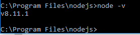

# 2 Things I Learned Form of Quiz Questions

1. Is the following code synchronous or asunchronous?

  ```js
  var food = fs.readFile('food.txt','utf8',function(err,food){
    if (err) {
      console.log(err);
    } else {
      console.log(food);
    }
  });
  ```
  
  ## Answer: asynchronous because it uses a callback function
  
2. Is the following code blocking or non-blocking? 

    ```js
    fs.readFile('textFile.txt','utf8',function(err,data){
        console.log(data);
    });
    ```

    ##Answer: **Non-blocking** since it *uses callback function*.

# 2 Questions I still have are...

* How should a person who does not fully understand what web servers are, learn Node.js?
* Node.js uses some complex web terms, how shall a person who is confused about these terms like proxy, headers, etc,. make himself comfortable with the web?  


Format: 
